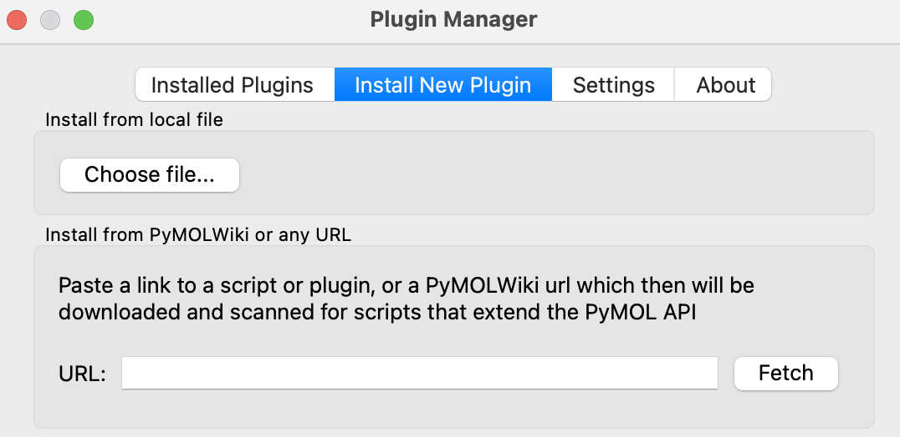

# Score Viewer Plugin
PyMOL plugin to load pdb/cif files directly from a csv file using a score-based selection of designs/models. 
Tested with PyMOL 3.1.6.1 and 2.5.5

## Installation

### Installation with PyMOL plugin manager
Open PyMOL and navigate to Plugin > Plugin Manager > Install New Plugin. You can choose to download the code and install from the local file or you can download the code directly from the Github repo. 



#### Local file
Download the code as archive (.zip) from GitHub to your computer (Code > Download ZIP). In PyMOL's plugin manager click "Choose File..." and select the zip archive you just downloaded from Github. Follow the instructions. Usually it is best to install in the default directory suggested by the Plugin Manager. Restart PyMOL. 

#### Download Code through PyMOL's Plugin Manager
Alternatively, navigate to Plugin > Plugin Manager > Install New Plugin. Copy the url to the GitHub repo
```
https://github.com/ngoldb/score_viewer_plugin
```
into the URL field and click "Fetch". Select the default directory suggested by the Plugin Manager.

Check here for more information about plugins in PyMOL: https://pymolwiki.org/index.php/Plugins#Installing_Plugins

### Using git
Navigate to the PyMOL plugin directory and clone the GitHub repo.

For MacOS:
```
cd /Applications/PyMOL.app/Contents/lib/python3.10/site-packages/pmg_tk/startup
git clone https://github.com/ngoldb/score_viewer_plugin.git
```

See here for more information on how to find the correct directory: https://pymol.org/plugins.html

## Usage
- Open PyMOL
- Plugin -> Score Viewer, a window should appear
- Load csv file containing score values and paths to the pdb/cif files
- Switch to Scatter tab and plot scores
- Use mouse to select data points
- Click Sync with PyMOL to display the selected designs