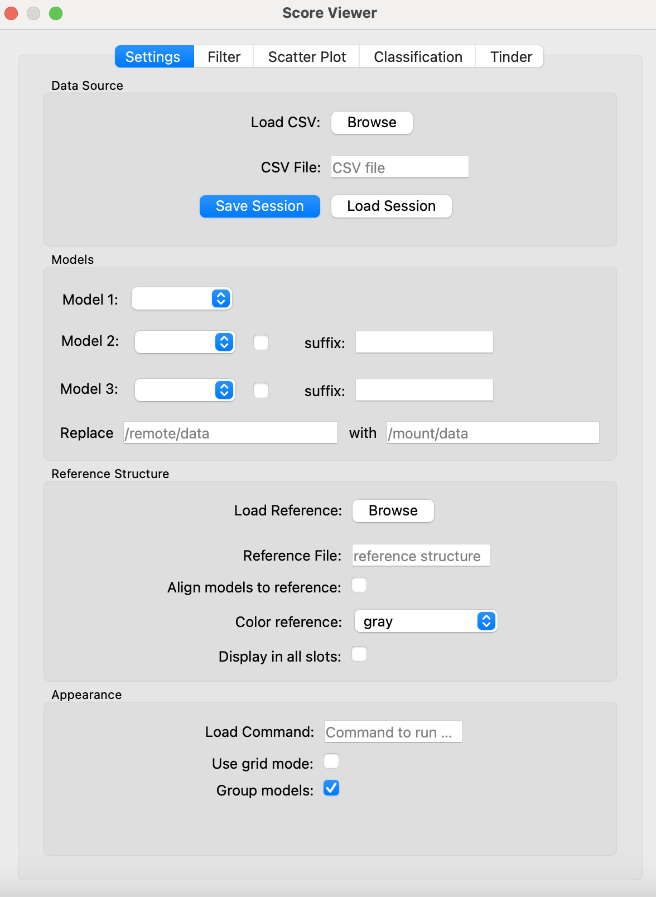
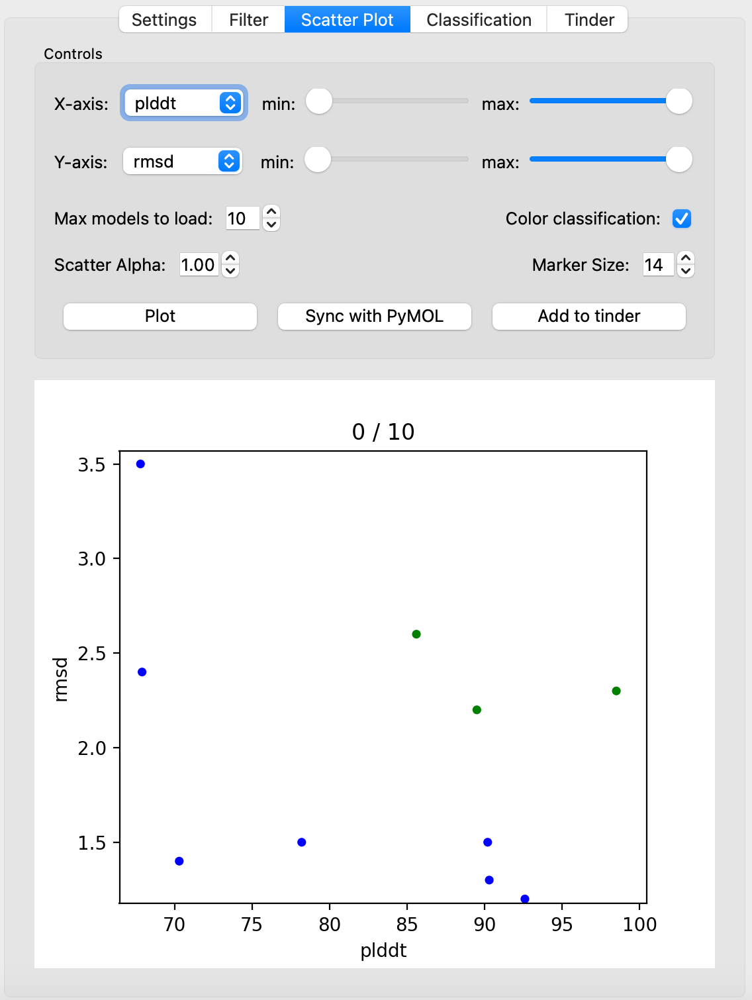
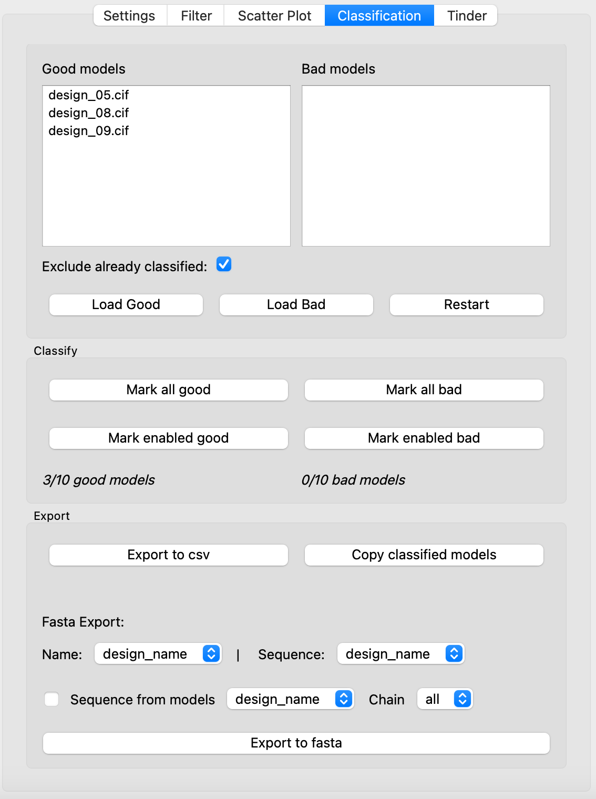
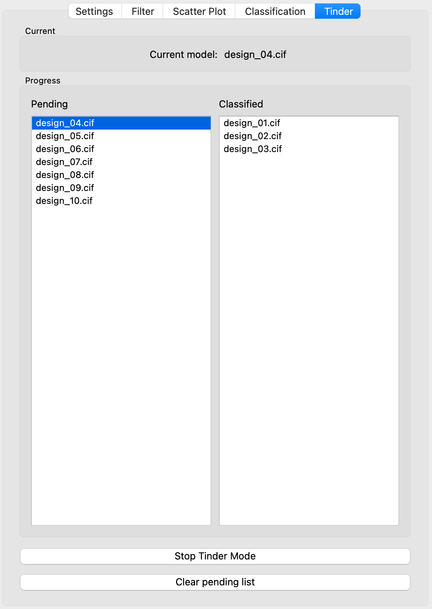

# Score Viewer Plugin
PyMOL plugin to load pdb/cif files directly from a csv file using a score-based selection of designs/models. 
Tested with PyMOL 3.1.6.1 and 2.5.5

## Installation

### Installation with PyMOL plugin manager
Open PyMOL and navigate to Plugin > Plugin Manager > Install New Plugin. You can choose to download the code and install from the local file or you can download the code directly from the Github repo. 
<div>
  
</div>

#### Local file
Download the code as archive (.zip) from GitHub to your computer (Code > Download ZIP). In PyMOL's plugin manager click "Choose File..." and select the zip archive you just downloaded from Github. Follow the instructions. Usually it is best to install in the default directory suggested by the Plugin Manager. Restart PyMOL. 

#### Download Code through PyMOL's Plugin Manager
Alternatively, navigate to Plugin > Plugin Manager > Install New Plugin. Copy the url to the GitHub repo
```
https://github.com/ngoldb/score_viewer_plugin
```
into the URL field and click "Fetch". Select the default directory suggested by the Plugin Manager.

Check here for more information about plugins in PyMOL: https://pymolwiki.org/index.php/Plugins#Installing_Plugins

### Using git
Navigate to the PyMOL plugin directory and clone the GitHub repo.

For MacOS:
```
cd /Applications/PyMOL.app/Contents/lib/python3.10/site-packages/pmg_tk/startup
git clone https://github.com/ngoldb/score_viewer_plugin.git
```

See here for more information on how to find the correct directory: https://pymol.org/plugins.html

## Usage
To start Score Viewer open PyMOL and select Plugin > Score Viewer. A new window should open. Score Viewer has multiple tabs to organise the different options and functions. A usual workflow would start on the left and proceed to the right (Settings, Filter, Scatter Plot, Classification). Most options should be intuitive. Many buttons and checkboxes have Tip Tools, which show a more detailed message when hovering the mouse over the widget.

Note: \
Score Viewer will disable PyMOL's undo function for nostalgic reasons (and stability: if undo is not disabled, ```align``` will fail after 4 executions)

### Settings
<div>
  
</div>
This tab defines general settings of the plugin and is used to load data or previously saved states of the plugin.

#### Loading Data
- Browse: load a csv file containing scores and model paths
- Save Session: save the current scoreviewer state to disk. This only saves the settings associated with the plugin. Data (e.g. the csv with the scores) and models will not be saved to disk in this file.
- Load Session: Load a previously saved state of the plugin

#### Models
The "Models" box allows the user to choose up to 3 models to be loaded per design simultaneously. This can be useful if you generated multiple models during the design (e.g. backbone from RFDiffusion and prediction from AlphaFold). 
- select the column names of the csv from the dropdown menus to specify which models to use
- the checkbox next to the dropdown allows to enable or disable loading of the respective model
- PyMOL does not allow objects to have the same name. If the different models have the same name, but are located in different directories, you can add a suffix to the object names of models 2 and 3.

In many cases the pdb or cif files are located on a remote file system (e.g. of an HPC). If the remote filesystem was mounted to the computer running PyMOL, the paths to the models will change and the paths stored in the csv file will not work. In such a case Score Viewer provides a function to correct the paths when loading the files. For example:
- Replace ```/home/user/project/predictions```
- with ```/mount/project/predictions```

will update the path of e.g. ```/home/user/project/predictions/design_model_0001.pdb``` to ```/mount/project/predictions/design_model_0001.pdb```

#### Reference Structure
Here you can load a reference structure (e.g. the structure of a target receptor etc.).
- click browse to load a reference pdb or cif file
- check "Align models to reference" to align all models to the reference structure (or at least alignment will be attempted... PyMOL is not great at this). 
- you can choose a color for the reference from the dropdown menu. 
- check "Display in all slots" to display the reference structure in all grid slots if using grid mode (see below, by default the reference is only shown in slot 1)

#### Appearance
Here you can modify the appearance of the loaded models. The "Load Command" needs to be in PyMOL syntax (e.g. ```color red; show sticks``` to color the models red and display side chains as sticks). This command will be executed every time models are loaded into the PyMOL viewer.
- check "Use grid mode" to show multiple models per design side by side
- check "Group models" to automatically group multiple models per design into groups and keep the gui tidy

Note: \
Score Viewer will set the maximal number of allowed grid slots to the number of models selected per design (1, 2, or 3). If you want to manually change the grid layout you may need to change this setting again using e.g.```set grid_max, 4``` to increase the maximum number of grid slots to 4.

### Filter
This tab provides filters to filter the models based on their scores. There are 4 filters available. The score dropdown menu will automatically be filled with available scores upon loading a csv file. When selecting a 
Here the input data can be filtered. One can select different scores and filter for designs where the respective score is between the user provided minium and maximum value. Data points not passing filters will not be plotted or loaded in the subsequent steps. Typically, one would remove e.g. low confidence designs here (e.g. by filtering plddt to be between 0.8 and 1.0). \
Start by selecting the score to be filtered from the dropdown menu. If there are no scores displayed, you need to load a csv file first. Once a score was selected, the minimum and maximum values of the respective metric will be displayed next to the spin box. Enter the minimum and maximum values for the filter and check "Apply filter". The number of designs passing the filter will be displayed.\
Proceed with the additional filters in the same way. Note that individual filters are independent from each other. Once you are done setting up all filters, click the button at the bottom to filter the input data. The number of designs passing all filters will be displayed and the scatter plot should be updated automatically.

### Scatter Plot
<div>
  
</div> 
This is an interactive scatter plot.

- choose the scores to be plotted on x and y axis (dropdown menus will be populated with score names upon loading a csv file)
- use the sliders to adjust the axis range (very hacky zoom tool, but it works)
- you can adjust the styling of the plot (marker size and alpha)
- click "Plot" to update the scatter plot

You can now use your mouse as a lasso selection to select the data points you are interested in. The selected data points will be highlighted and the number of selected designs will be displayed on top of the scatter plot. To unselect everything: click in the white space in the scatter plot.

- click "Sync with PyMOL" to load the selected models into the 3D viewer of PyMOL (this will reset the 3D viewer and delete all currently loaded models)
- to prevent PyMOL from crashing when loading many models, there is a spin box allowing the user to specify the maximum number of models to be loaded (default: 10). If the number of selected models exceeds the maximum number specified, a random selection will be loaded. You can use PyMOL just as usual to explore the models
- models which had already been classified as good or bad will be colored green (good) or red (bad) in the scatter plot
- add to tinder: this button will add the selected models (all selected, not only the displayed models) to the pending list in the tinder tab

### Classification
<div>
  
</div> 
You can classify designs into two categories: good or bad using the buttons in this menu. On the top lists of good and bad models are shown. You can click on the entries to load any of the models into PyMOL.

- check "Exclude already classified" to not load already classified models again
- Load Good will load all models classified as good (max. models to load settings applies!)
- Load Bad will load all models classified as bad (max. models to load settings applies!)
- Restart will clear all classified models

To classify models as good or bad use the buttons:
- enabled: only objects enabled in PyMOL will be classified
- all: all models loaded in PyMOL (not all selected!) will be classified

The current number of good/bad models and the total number of designs will be displayed below the buttons. The lists on top will update to show the classified designs. A design can never be in both good and bad models. If you re-classify a model, the most recent classification will be applied (e.g. if the model was already classified as good, but you reload it and classify it as good, the model will be removed from good and added to bad). Be careful with the classification: there is no undo!

You can export the classified models in various ways:
- Export to csv will allow you to choose a location and write two csv files with scores and paths for good and bad designs
- Copy classified models will allow you to choose a location and copy the bad and good models to this location

You can also export the sequences to a fasta file:
- select the name and the sequence from the dropdown menus. This requires that the csv you loaded in the very beginning contains the design name and the design sequence

If you forgot to write the design name and sequence to the csv score file (I heard this can happen) you can retrieve the design name and sequence by loading the models and getting the sequence from there:
- check the box "Sequence from models"
- select the model to be used from the dropdown menu
- select the chain from the dropdown menu 

Score Viewer will then load the selected models into PyMOL and derive the sequence of the selected chain using PyMOL's ```cmd.get_fastastr()``` function. 

### Tinder
<div>
  
</div> 
Tinder (Through Inspection Never Discard Excellent pRoteins) uses the arrow keys (left and right) to classify models. 

- add models to the pending list (Scatter Plot tab --> select designs --> add to tinder)
- click "Start Tinder Mode"

Models are now loaded one by one into PyMOL. Pressing left or right arrow keys will classify the loaded model as good (right arrow key) or bad (left arrow key) and automatically load the next model from the pending list. Keep in mind that a pretty surface can not compensate for a badly packed core.